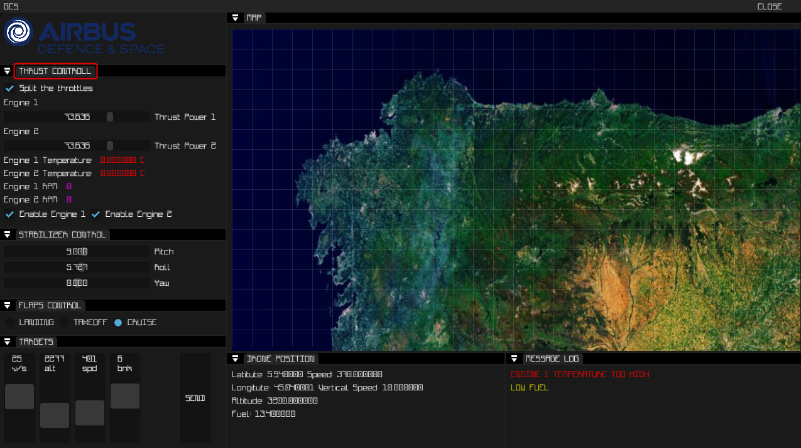

# Project Name

Brief description of the project.

## Table of Contents

- [Installation](#installation)
- [Usage](#usage)
- [Contributing](#contributing)
- [License](#license)

## Installation

Instructions on how to install and set up the project.

## Usage

Instructions on how to use the project and any relevant examples.

## Contributing

Guidelines on how to contribute to the project and how to set up a development environment.

## License

Information about the project's license and any additional terms or conditions.
